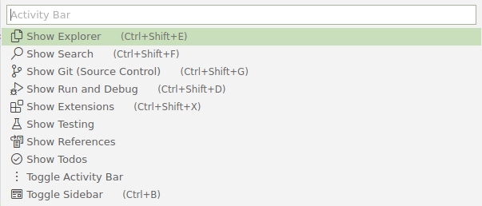
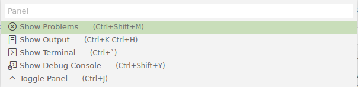
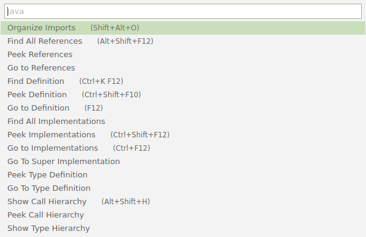
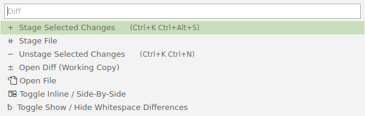

# Mini Command Palette Examples

## Activity Bar Palette (Ctrl+Alt+B)



settings.json
```jsonc
"baincd.mini-command-palettes.paletteConfigs": {
    "activity-bar-palette": {
        "placeHolder": "Activity Bar",
        "commands": [
            {
                "label": "$(explorer-view-icon) Show Explorer",
                "description": "     (Ctrl+Shift+E)",
                "command": "workbench.view.explorer"
            },
            {
                "label": "$(search-view-icon) Show Search",
                "description": "     (Ctrl+Shift+F)",
                "command": "workbench.action.findInFiles"  // or workbench.view.search
            },
            {
                "label": "$(source-control-view-icon) Show Git (Source Control)",
                "description": "     (Ctrl+Shift+G)",
                "command": "workbench.view.scm"
            },
            {
                "label": "$(run-view-icon) Show Run and Debug",
                "description": "     (Ctrl+Shift+D)",
                "command": "workbench.view.debug"
            },
            {
                "label": "$(extensions-view-icon) Show Extensions",
                "description": "     (Ctrl+Shift+X)",
                "command": "workbench.view.extensions"
            },
            {
                "label": "$(test-view-icon) Show Testing",
                "command": "workbench.view.extension.test"
            },
            {
                "label": "$(references) Show References",
                "command": "workbench.view.extension.references-view"
            },
            {
                "label": "$(pass) Show Todos",
                "command": "workbench.view.extension.todo-tree-container",
                "showWhen": {
                    "extensionEnabled": "gruntfuggly.todo-tree"
                }
            },
            {
                "label": "$(kebab-vertical) Toggle Activity Bar",
                "command": "workbench.action.toggleActivityBarVisibility"
            },
            {
                "label": "$(preview) Toggle Sidebar",
                "description": "     (Ctrl+B)",
                "command": "workbench.action.toggleSidebarVisibility"
            },
        ]
    },
},
```

```jsonc
{ "key": "ctrl+alt+b",           "command": "baincd.mini-command-palettes.cmds.activity-bar-palette" },
```

## Panel Palette (Ctrl+Alt+J)



settings.json
```jsonc
"baincd.mini-command-palettes.paletteConfigs": {
    "panel-palette": {
        "placeHolder": "Panel",
        "commands": [
            {
                "label": "$(error) Show Problems",
                "description": "     (Ctrl+Shift+M)",
                "command": "workbench.actions.view.problems"
            },
            {
                "label": "$(output-view-icon) Show Output",
                "description": "     (Ctrl+K Ctrl+H)",
                "command": "workbench.action.output.toggleOutput"
            },
            {
                "label": "$(terminal-view-icon) Show Terminal",
                "description": "     (Ctrl+`)",
                "command": "workbench.action.quickOpenTerm" // or workbench.action.terminal.toggleTerminal
            },
            {
                "label": "$(debug-console) Show Debug Console",
                "description": "     (Ctrl+Shift+Y)",
                "command": "workbench.debug.action.toggleRepl"
            },
            {
                "label": "$(chevron-up) Toggle Panel",
                "description": "     (Ctrl+J)",
                "command": "workbench.action.togglePanel"
            },
        ]
    },
},
```

```jsonc
{ "key": "ctrl+alt+j",           "command": "baincd.mini-command-palettes.cmds.panel-palette" },
```

## Java Dev Palette (Ctrl+Alt+;)



settings.json
```jsonc
"baincd.mini-command-palettes.paletteConfigs": {
    "java-dev":{
        "placeHolder": "Java",
        "commands": [
            {
                "label": "Organize Imports",
                "description": "     (Shift+Alt+O)",
                "command": "editor.action.organizeImports"
            },
            {
                "label": "Find All References", 
                "description": "     (Alt+Shift+F12)",
                "command": "references-view.findReferences"
            },
            {
                "label": "Peek References",
                "command": "editor.action.referenceSearch.trigger"
            },
            {
                "label": "Go to References",
                "descriptions": "     (Shift+F12)",
                "command": "editor.action.goToReferences"
            },
            {
                "label": "Find Definition",
                "description": "     (Ctrl+K F12)",
                "command": "editor.action.revealDefinitionAside"
            },
            {
                "label": "Peek Definition",
                "description": "     (Ctrl+Shift+F10)",
                "command": "editor.action.peekDefinition"
            },
            {
                "label": "Go to Definition",
                "description": "     (F12)",
                "command": "editor.action.revealDefinition"
            },
            {
                "label": "Find All Implementations",
                "command": "references-view.findImplementations"
            },
            {
                "label": "Peek Implementations",
                "description": "     (Ctrl+Shift+F12)",
                "command": "editor.action.peekImplementation"
            },
            {
                "label": "Go to Implementations",
                "description": "     (Ctrl+F12)",
                "command": "editor.action.goToImplementation"
            },
            {
                "label": "Go To Super Implementation",
                "command": "java.action.navigateToSuperImplementation",
                "showWhen": {
                    "extensionEnabled": "redhat.java"
                }
            },
            {
                "label": "Peek Type Definition",
                "command": "editor.action.peekTypeDefinition"
            },
            {
                "label": "Go To Type Definition",
                "command": "editor.action.goToTypeDefinition"
            },
            {
                "label": "Show Call Hierarchy",
                "description": "     (Alt+Shift+H)",
                "command": "references-view.showCallHierarchy"
            },
            {
                "label": "Peek Call Hierarchy",
                "command": "editor.showCallHierarchy"
            },
            {
                "label": "Show Type Hierarchy",
                "command": "java.action.showTypeHierarchy",
                "showWhen": {
                    "extensionEnabled": "redhat.java"
                }
            },
        ]
    },
},
```

```jsonc
{ "key": "ctrl+alt+;",           "command": "baincd.mini-command-palettes.cmds.java-dev" },
```

## Diff Palette (Ctrl+Alt+/)



settings.json
```jsonc
"baincd.mini-command-palettes.paletteConfigs": {
    "diff-palette": {
        "placeHolder": "Diff",
        "commands": [
            {
                "label": "+  Stage Selected Changes",
                "description": "     (Ctrl+K Ctrl+Alt+S)",
                "command": "git.stageSelectedRanges"
            },
            {
                "label": "⧺  Stage File",
                "command": "git.stage"
            },
            {
                "label": "−  Unstage Selected Changes",
                "description": "     (Ctrl+K Ctrl+N)",
                "command": "git.unstageSelectedRanges"
            },
            {
                "label": "±  Open Diff (Working Copy)",
                "command": "git.openChange"
            },
            {
                "label": "$(go-to-file) Open File",
                "command": "git.openFile"
            },
            {
                "label": "$(diff) Toggle Inline / Side-By-Side",
                "command": "toggle.diff.renderSideBySide"
            },
            {
                "label": "␢  Toggle Show / Hide Whitespace Differences",
                "command": "toggle.diff.ignoreTrimWhitespace"
            },
        ]
    }
},
```

```jsonc
{ "key": "ctrl+alt+/",           "command": "baincd.mini-command-palettes.cmds.diff-palette"
```
