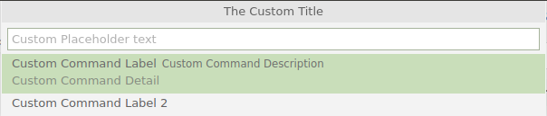

# Mini Command Palettes

Create custom, mini command palettes (quick-pick lists of commands)


## Why

VS Code has 686 default keyboard shortcuts (as of 1.60.0), and that doesn't include additional shortcuts added by extensions.  While I have managed to memorize quite a few of them, I have a limited capacity for the number of keyboard shortcuts I can remember.

And although the command palette (Ctrl+Shift+P) is extremely useful, I sometimes just want a curated list of commands - for example, frequently used git commands or Java commands.

This extension allows you to define as "custom mini command palettes", and bind them to your own keyboard shortcuts.

## Configuration

### Mini Command Palette Settings

#### Example 

```jsonc
"baincd.mini-command-palettes.paletteConfigs": {
    "custom-palette-1": {
        "matchOnDescription": false, // optional
        "matchOnDetail": false, // optional
        "placeHolder": "Custom Placeholder text", // optional
        "title": "The Custom Title", // optional
        "commands": [
            {
                "label": "Custom Command Label",
                "description": "Custom Command Description", // optional
                "detail": "Custom Command Detail", // optional
                "command": "command id",
                "commandArgs": ["arg1", "arg2" ], // optional
                "showWhen": { // optional
                    "extensionEnabled": "example.extension-id"
                }
            },
            {
                "label": "Custom Command Label 2",
                "command": "command id2",
            },
        ]
    },
},
```



#### Details

`matchOnDescription`, `matchOnDetail`, `placeHolder`, and `title` all correspond to [QuickPickOptions in the VS Code API](https://code.visualstudio.com/api/references/vscode-api#QuickPickOptions).

`label`, `description`, and `detail` correspond to [QuickPickItem in the VS Code API](https://code.visualstudio.com/api/references/vscode-api#QuickPickItem).  These fields can all support rendering of [theme icons](https://code.visualstudio.com/api/references/icons-in-labels#icon-listing) via the $(&lt;name&gt;)-syntax.

`command` and `commandArgs` correspond to arguments to the [executeCommand API method](https://code.visualstudio.com/api/references/vscode-api#commands.executeCommand).

- To find command ids, Open the keyboard shortcuts UI using "Preferences: Open Keyboard Shortcuts", then search for the command you want.  Right-click and choose "Copy Command ID".
- To configure an command that runs a specific task, use 
```json
      "command": "workbench.action.tasks.runTask",
      "commandArgs": ["{Task Label}"]
```
- VS Code does not support a command to start a specific launch configuration.  [As a workaround](https://stackoverflow.com/a/48650929/4764903), use the command id `workbench.action.debug.selectandstart` to display a popup to select the launch configuration to start.

When `showWhen.extensionEnabled` is set, the command will only be displayed in the mini command palette when that extension is installed and enabled.


### Keyboard Shortcut 

#### Example

To bind the above example to a keyboard shortcut, use the following keyboard shortcut setting.

```jsonc
{ "key": "ctrl+alt+a",           "command": "baincd.mini-command-palettes.cmds.custom-palette-1" }
```

Note that a command will be created for each paletteConfig in settings.  The command will be in the format of `baincd.mini-command-palettes.cmds.{paletteName}`

### Tips

To enable the mini command palette keyboard shortcuts when an integrated terminal has focus, add the commands to the following setting:

```jsonc
    "terminal.integrated.commandsToSkipShell": [
        // Any other commands 
        "baincd.mini-command-palettes.cmds.custom-palette-1",
    ],

```

[Click here for more details](https://code.visualstudio.com/docs/editor/integrated-terminal#_keybindings-and-the-shell)

## Examples

[Here are some example configurations to get you started](Examples.md)
